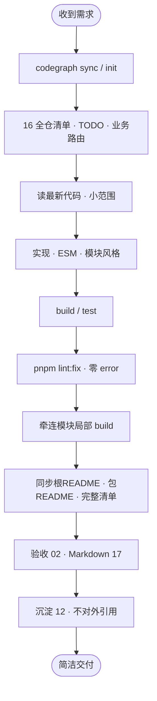

# core-x Cursor Rules

> **本目录仅给 Cursor 模型与人类维护者使用**，不出现在仓库对外文档中。

## 目的

将模型对仓库的**客观认知**整理为可执行规范，使下次任务：

1. **少重复扫描** — 先读 `16-全仓资产清单`、`business/任务路由索引`
2. **少踩坑** — 流程、ESM、Nest DI、VitePress API 等已沉淀
3. **交付一致** — 验收、lint、文档同步有统一清单

模型任务中验证过的新事实，须按 `12-规则维护与知识沉淀` 回写本目录（**不臆造**）。

- **`.mdc`** → 模型自动加载的执行规范
- **本 README、`TODO.md`** → 人类了解模型如何工作

## 模型工作流



## 目录

仅两个子目录，规则文件使用中文命名：

```
.cursor/rules/
├── README.md · TODO.md     # 人类维护
├── engineering/            # 工程化：流程、Mermaid、命令、协作、规则边界
│   └── 00 … 17（含全仓清单、Markdown、scripts）
└── business/               # 业务：包职责、任务路由、风格、ESM、技术栈专项
    ├── 包职责地图.mdc · 任务路由索引.mdc · 模块开发索引.mdc
    ├── 代码风格统一.mdc · ESM与模块发布.mdc
    └── TypeScript规范.mdc · Vue组件规范.mdc · unbuild打包.mdc
        Nest开发.mdc · Egg开发.mdc · VitePress开发.mdc · 测试规范.mdc
```

## 关键规则

| 主题 | 文件 |
|------|------|
| 全仓认知 | `engineering/16-全仓资产清单` |
| 工作流 | `engineering/01-执行流程`、`engineering/13-模型协作规范` |
| Mermaid | `engineering/10`（少用 subgraph）、`engineering/07` 与根 README 同构 |
| Markdown | `engineering/17-Markdown文档规范` |
| Lint / Build | `engineering/02`（error 禁止、warning 允许；lint 后局部 build） |
| 文档完整 | `engineering/09`（30 包 + 4 demo 不遗漏） |
| ESM/CJS | `business/ESM与模块发布` |
| 任务路由 | `business/任务路由索引`、`business/包职责地图` |
| 命令 | `engineering/08`（含 filter 与 cd 等价） |
| 文档站 | `engineering/09`（清单完整）、`business/VitePress开发` |
| scripts | `engineering/15-scripts脚本手册` |
| 禁止对外引用 rules | `engineering/14-规则边界` |
| 沉淀 | `engineering/12` |

## 人类维护

- 架构图以**根 README** 为准，同步到 `engineering/07-仓库架构与流程`
- 包/目录变更时同步 `engineering/16-全仓资产清单`
- 不在仓库其他 README/代码中链接本目录（`engineering/14-规则边界`）
- 大版本发布后更新 `TODO.md`
