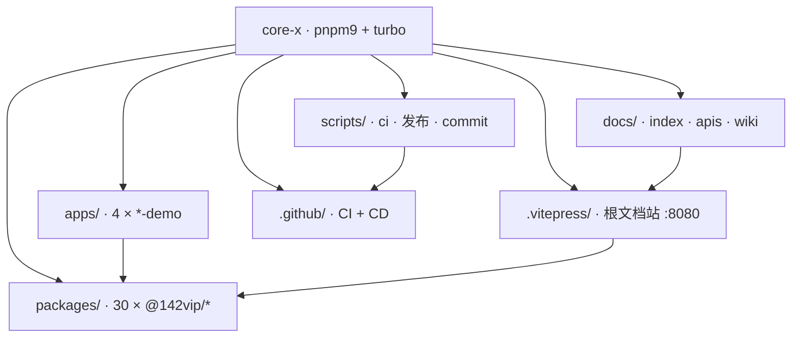
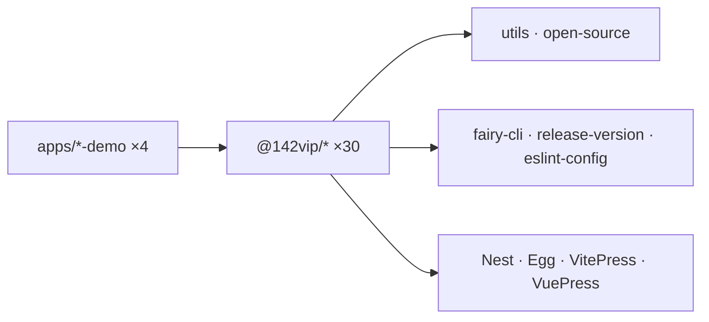
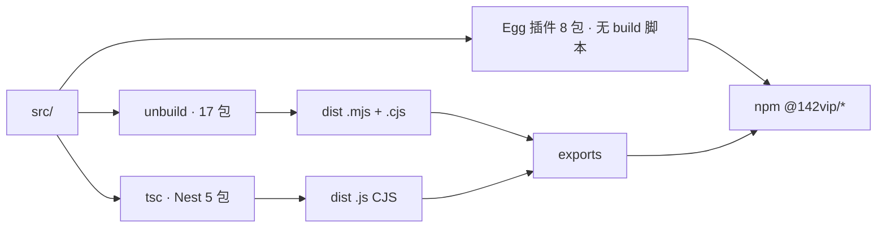
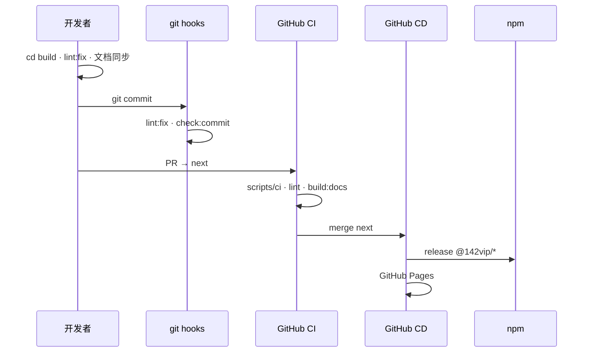
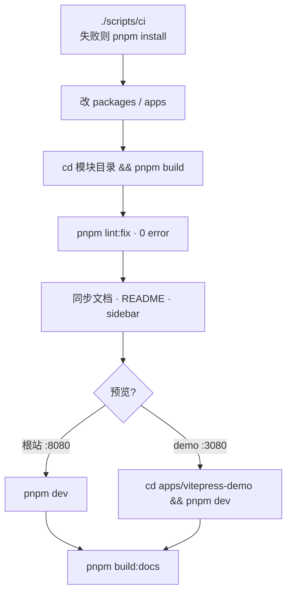

# @142vip/core-x

`X`代表一切都有可能，`core-x` 仓库是基于自身技术栈在进行工程化实践中封装的工具包、通用模块。

## 在线浏览

- Github： <https://142vip.github.io/core-x>
- Netlify： <https://pkg-x.netlify.app>
- Vercel： <https://pkg-x.vercel.app>

## 我的开源

### 示例项目

- [`egg-demo`](https://github.com/142vip/core-x/tree/main/apps/egg-demo)
- [`nest-demo`](https://github.com/142vip/core-x/tree/main/apps/nest-demo)
- [`vitepress-demo`](https://github.com/142vip/core-x/tree/main/apps/vitepress-demo)
- [`vuepress-demo`](https://github.com/142vip/core-x/tree/main/apps/vuepress-demo)

### 开源模块

- [`@142vip/axios`](https://www.npmjs.com/package/@142vip/axios)
- [`@142vip/changelog`](https://www.npmjs.com/package/@142vip/changelog)
- [`@142vip/commit-linter`](https://www.npmjs.com/package/@142vip/commit-linter)
- [`@142vip/copyright`](https://www.npmjs.com/package/@142vip/copyright)
- [`@142vip/data-source`](https://www.npmjs.com/package/@142vip/data-source)
- [`@142vip/egg`](https://www.npmjs.com/package/@142vip/egg)
- [`@142vip/egg-axios`](https://www.npmjs.com/package/@142vip/egg-axios)
- [`@142vip/egg-grpc-client`](https://www.npmjs.com/package/@142vip/egg-grpc-client)
- [`@142vip/egg-grpc-server`](https://www.npmjs.com/package/@142vip/egg-grpc-server)
- [`@142vip/egg-mysql`](https://www.npmjs.com/package/@142vip/egg-mysql)
- [`@142vip/egg-redis`](https://www.npmjs.com/package/@142vip/egg-redis)
- [`@142vip/egg-sequelize`](https://www.npmjs.com/package/@142vip/egg-sequelize)
- [`@142vip/egg-swagger`](https://www.npmjs.com/package/@142vip/egg-swagger)
- [`@142vip/egg-validate`](https://www.npmjs.com/package/@142vip/egg-validate)
- [`@142vip/eslint-config`](https://www.npmjs.com/package/@142vip/eslint-config)
- [`@142vip/fairy-cli`](https://www.npmjs.com/package/@142vip/fairy-cli)
- [`@142vip/grpc`](https://www.npmjs.com/package/@142vip/grpc)
- [`@142vip/nest`](https://www.npmjs.com/package/@142vip/nest)
- [`@142vip/nest-logger`](https://www.npmjs.com/package/@142vip/nest-logger)
- [`@142vip/nest-redis`](https://www.npmjs.com/package/@142vip/nest-redis)
- [`@142vip/nest-starter`](https://www.npmjs.com/package/@142vip/nest-starter)
- [`@142vip/nest-typeorm`](https://www.npmjs.com/package/@142vip/nest-typeorm)
- [`@142vip/oauth2.0`](https://www.npmjs.com/package/@142vip/oauth2.0)
- [`@142vip/open-source`](https://www.npmjs.com/package/@142vip/open-source)
- [`@142vip/redis`](https://www.npmjs.com/package/@142vip/redis)
- [`@142vip/release-version`](https://www.npmjs.com/package/@142vip/release-version)
- [`@142vip/typeorm`](https://www.npmjs.com/package/@142vip/typeorm)
- [`@142vip/utils`](https://www.npmjs.com/package/@142vip/utils)
- [`@142vip/vitepress`](https://www.npmjs.com/package/@142vip/vitepress)
- [`@142vip/vuepress`](https://www.npmjs.com/package/@142vip/vuepress)

## 使用

```shell
# 安装依赖（首选 ./scripts/ci，与 CI 一致；有问题再用 pnpm install）
./scripts/ci
# 若 ci 失败：pnpm install

# 文档站开发（根目录）
pnpm dev                    # 根站 :8080

# 单包 / demo（推荐进入对应目录）
cd packages/vitepress && pnpm build
cd apps/vitepress-demo && pnpm dev      # :3080

# 全量编译（根目录）
pnpm build:packages         # 所有 @142vip/* 包
pnpm build:apps             # 所有 *-demo
pnpm build:docs             # 文档站 + TypeDoc API
pnpm build                  # 全量

# 代码质量（根目录，提交前必跑）
pnpm lint
pnpm lint:fix

# 测试
pnpm test
cd packages/utils && pnpm test

# 清理缓存
pnpm clean:cache
```

## 仓库架构

pnpm 9 + Turbo monorepo：`packages/` 含 30 个可发布 `@142vip/*` npm 包，`apps/` 含 4 个 `*-demo` 示例。



## 技术分层



## 模块发布

npm 包默认 **ESM** 交付，**同时提供 CJS** 以兼容 `require`（unbuild 双格式）；Nest 系为 CommonJS；Egg 子插件多为源码直发。



## 开发与发布流程



## 本地开发流程



## 趋势

<a href="https://github.com/142vip/core-x" title="@142vip/core-x">
  <picture>
    
  </picture>
</a>

## 贡献者

**感谢所有向仓库贡献代码的开发者**

<a href="https://github.com/142vip/core-x/graphs/contributors">
  
</a>

## 联系作者

若系列文章对你有所帮助，欢迎订阅公众号或微信”骚扰“，获取更多内容。**商务合作请备注来意**

<div align="center" style="text-align: center;margin: 10px" id="we-media-container">
    <div align="center" >
            
    </div>
</div>

交流/加群/互看朋友圈、**聊天/提问/建议/提需求** 可以在公众号直接**私信**，有时间即会回复，偶尔的延迟和疏漏还请小伙伴们谅解，蟹蟹。

<!-- #endregion we-media -->

## 证书

[MIT](https://opensource.org/license/MIT)

Copyright (c) 2019-present, @142vip 储凡

**仅供学习参考，商业使用请保留作者版权信息，作者不保证也不承担任何软件的使用风险。**
