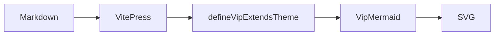
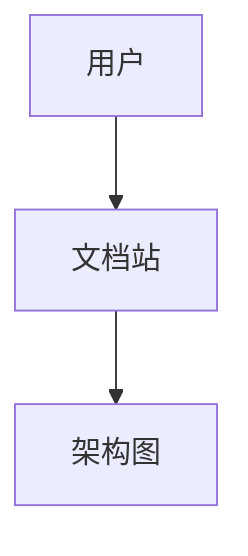
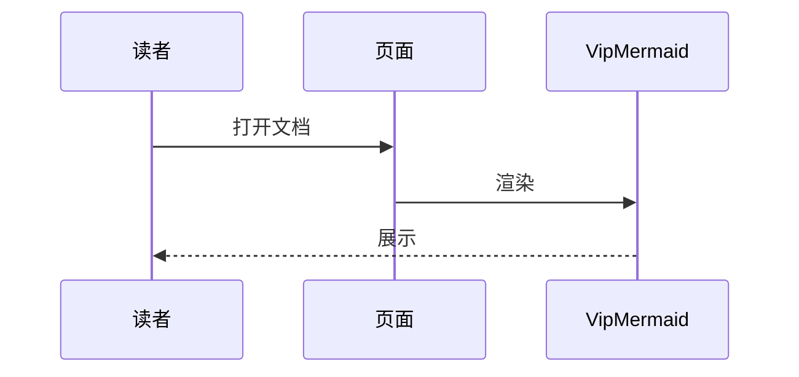
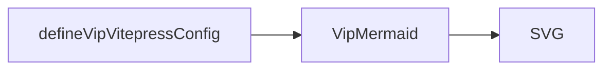

# Mermaid 架构图

切换站点外观时，图会按队列重绘：暗黑统一用官方 `dark`，亮色用所选主题。

## 默认



## 指定主题

可选：`default` | `forest` | `neutral` | `base` | `dark`

### forest



### neutral



### base



## 站点配置

```ts
defineVipVitepressConfig(config, {
  mermaid: { theme: 'default' }, // forest / neutral / base / dark
})
```

规则：亮色用所选官方主题；暗黑一律 `dark`（保证可读）。

站点需第二参数启用：

```ts
defineVipVitepressConfig(config, { mermaid: { theme: 'default' } })
```
