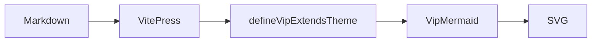
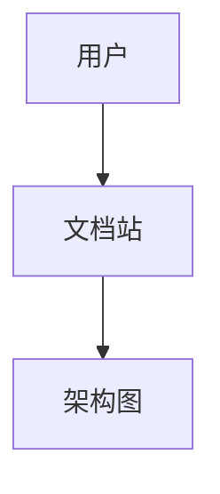
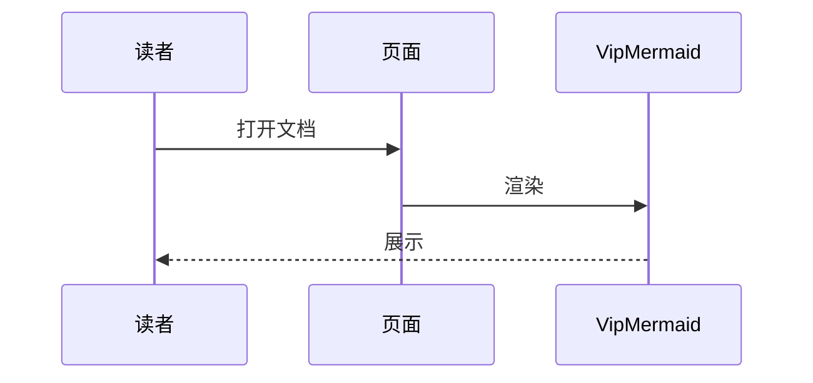
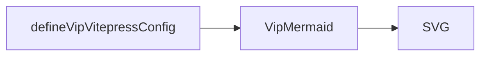

# Mermaid 架构图

切换站点外观时，图会按队列重绘：暗黑统一用官方 `dark`，亮色用所选主题。

## 交互能力

`VipMermaid` 会根据内容尺寸自动选择展示方式：

- **静态模式**：图能完整放入容器时居中显示，高度随内容自适应，右上角提供 **复制** 按钮
- **交互模式**：内容超出时启用固定视口，支持拖拽、缩放、还原、全屏，并提供 **复制** 按钮

复制功能会将 Markdown 代码块（` ```mermaid ` fence，不含主题）写入剪贴板，便于粘贴到官方 Mermaid 或其他编辑器中使用。

## 默认



## 指定主题

可选：`default` | `forest` | `neutral` | `base` | `dark`

### forest



### neutral



### base



## 站点配置

```ts
defineVipVitepressConfig(config, {
  mermaid: { theme: 'default' }, // forest / neutral / base / dark
})
```

规则：亮色用所选官方主题；暗黑一律 `dark`（保证可读）。

样式基于 VitePress CSS 变量（`--vp-c-*`），兼容站点明暗主题；全屏模式适配移动端安全区域。
