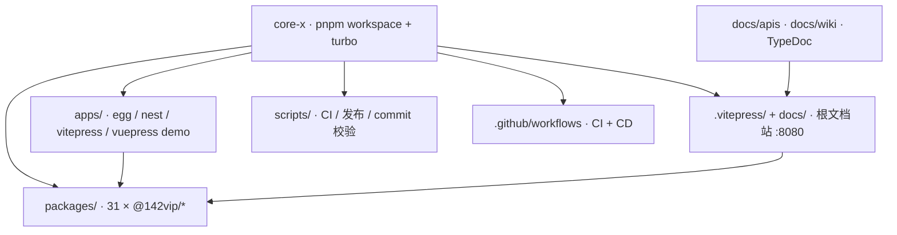
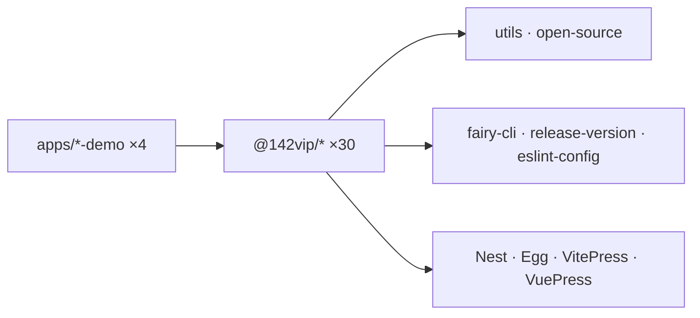
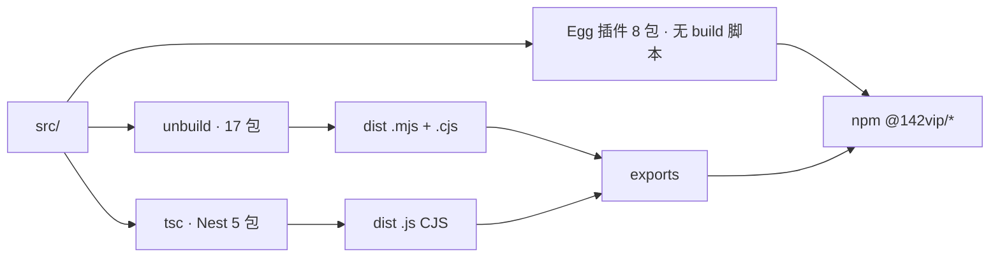
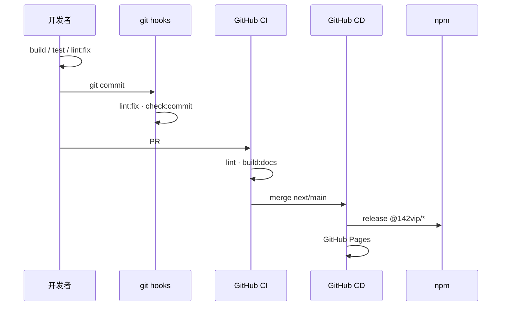
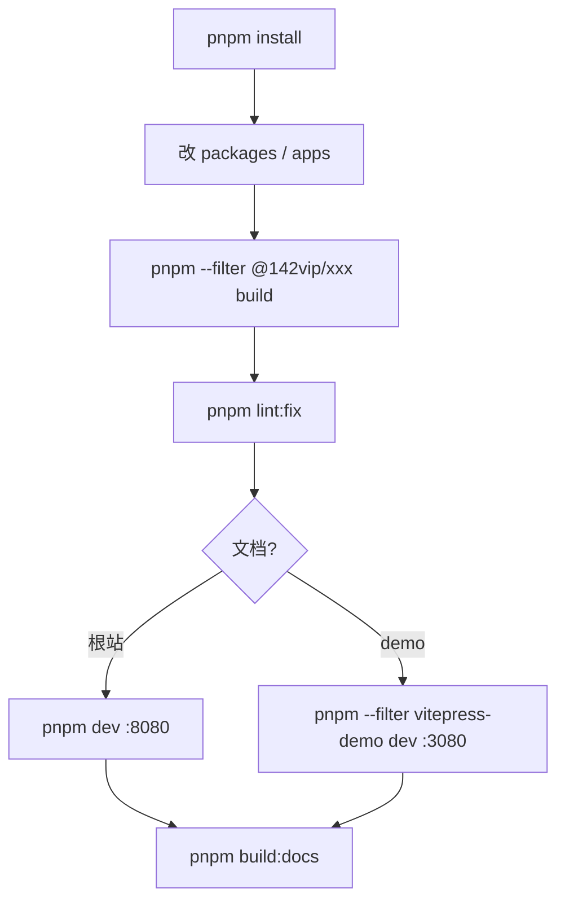

## 仓库架构

pnpm 9 + Turbo monorepo：`packages/` 含 31 个可发布 `@142vip/*` npm 包，`apps/` 含 4 个 `*-demo` 示例。

## 技术分层

## 模块发布

npm 包默认 **ESM** 交付，**同时提供 CJS** 以兼容 `require`（unbuild 双格式）；Nest 系为 CommonJS；Egg 子插件多为源码直发。

## 开发与发布流程

## 本地开发流程

<HomePage/>
