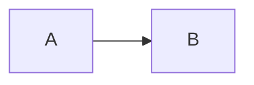

# @142vip/vitepress

基于 VitePress 的文档站封装：主题、Element Plus、**Mermaid 架构图**。

## 快速开始

### 1. 配置

```ts
import { defineVipVitepressConfig, getVipThemeConfig } from '@142vip/vitepress'

// 原用法（不变）
export default defineVipVitepressConfig({
  title: 'My Docs',
  themeConfig: getVipThemeConfig({ nav: [] }),
})

// 启用 Mermaid（第二参数拓展）
export default defineVipVitepressConfig({
  title: 'My Docs',
  themeConfig: getVipThemeConfig({ nav: [] }),
}, {
  mermaid: true, // 或 { theme: 'forest' }
})
```

### 2. 主题

```ts
import defineVipExtendsTheme from '@142vip/vitepress/theme'

export default defineVipExtendsTheme()
```

### 3. 写图（需已启用 mermaid）

````md



````

**主题规则**：亮色使用所选官方主题；暗黑模式统一使用官方 `dark`，保证可读性。

**展示模式**（`VipMermaid` 自动判断，无需额外配置）：

| 模式 | 触发条件 | 行为 |
|------|----------|------|
| 静态 | 图可完整放入容器 | 居中展示，高度随内容自适应，无操作按钮 |
| 交互 | 宽或高超出展示区域 | 固定视口、自动缩放居中，支持拖拽、滚轮 / 双指缩放、还原与全屏 |

交互能力仅在内容超出时出现；小图保持简洁，大图才提供缩放与全屏。样式使用 VitePress CSS 变量，兼容明暗主题与移动端。

## Demo

```shell
pnpm --filter @142vip/vitepress build
pnpm --filter vitepress-demo dev
```

## 证书

[MIT](https://opensource.org/license/MIT)

Copyright (c) 2019-present, @142vip 储凡
