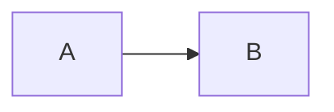

# @142vip/vitepress

基于 VitePress 的文档站封装：主题、Element Plus、**Mermaid 架构图**、全局页脚、默认品牌 favicon/Logo（`@142vip/cdn`）。

## 快速开始

### 1. 配置

`defineVipVitepressConfig` 自动合并 `defaultVipThemeConfig`（语言、目录、Markdown 等）与默认 favicon `head`。

```ts
import {
  defaultVipSocialLinks,
  defineVipVitepressConfig,
  enableVipFooter,
  getVipBrandCdnUrl,
  getVipThemeConfig,
  VIP_DEFAULT_FAVICON,
  VIP_DEFAULT_LOGO,
} from '@142vip/vitepress'

export default defineVipVitepressConfig({
  title: 'My Docs',
  // favicon：在 head 配置，已含 icon 时不注入默认项
  head: [
    ['link', { rel: 'icon', href: VIP_DEFAULT_FAVICON }],
  ],
  themeConfig: getVipThemeConfig({
    nav: [],
    // logo / socialLinks 有默认值，按需覆盖
    logo: VIP_DEFAULT_LOGO,
    socialLinks: defaultVipSocialLinks,
    ...enableVipFooter({
      showBackTop: true,
      showBadge: true,
      pkgName: '@142vip/example',
      pkgVersion: '0.0.1',
    }),
  }),
}, {
  mermaid: true,
})
```

包内默认为 **vip** 品牌（`VIP_DEFAULT_FAVICON` / `VIP_DEFAULT_LOGO`）；站点在 `config.ts` 显式覆盖，例如 core-x 使用 **x** 系列：

```ts
getVipThemeConfig({
  nav: [],
  logo: getVipBrandCdnUrl('svg/x-logo.svg'),
})

head: [['link', { rel: 'icon', href: getVipBrandCdnUrl('icons/x-favicon.ico') }]]
```

### 2. 主题

```ts
import defineVipExtendsTheme from '@142vip/vitepress/theme'
import { getTableData } from './project-data'

// VipHomePage 由主题注入，挂在首页 Markdown 正文之后、页脚之前
export default defineVipExtendsTheme(undefined, {
  homePage: {
    tables: [
      { title: '最佳实践', data: getTableData('example') },
      { title: '开源模块', data: getTableData('project') },
    ],
  },
})
```

`homePage` 传入配置对象时挂载内置 `VipHomePage`；`showTeam` / `showOpenSource` / `defaultSlot` 可扩展团队、开源与联系作者等区块。完全自定义时可传 `() => h(...)`，传 `false` 关闭。

### 3. 写图（需已启用 mermaid）

````md



````

**主题规则**：亮色使用所选官方主题；暗黑模式统一使用官方 `dark`，保证可读性。

**展示模式**（`VipMermaid` 自动判断，无需额外配置）：

| 模式 | 触发条件 | 行为 |
|------|----------|------|
| 静态 | 图可完整放入容器 | 居中展示，高度随内容自适应，无操作按钮 |
| 交互 | 宽或高超出展示区域 | 固定视口、自动缩放居中，支持拖拽、滚轮 / 双指缩放、还原与全屏 |

交互能力仅在内容超出时出现；小图保持简洁，大图才提供缩放与全屏。所有图表均支持复制 Markdown 代码块（` ```mermaid ` fence，不含主题配置）到剪贴板。样式使用 VitePress CSS 变量，兼容明暗主题与移动端。

## 页脚 `showBackTop` / `showBadge`

在 `enableVipFooter({ showBackTop: true })` 时挂载 `@142vip/vue` 的 `VipBackTop`；`pkgName` / `pkgVersion` / `showBadge` 透传 `VipFooter` 渲染 Release 与徽章。

| 值 | 行为 |
|----|------|
| `true` | 展示 `@142vip/vue` `VipFooter` 默认徽章（`showBadge: true`） |
| `false` / 未传 | 不展示徽章 |
| `VipFooterBadgeLink[]` | 自定义 `href` / `src` / `alt` 列表 |

## 默认 favicon / Logo / 社交链接

品牌与站点默认项集中在 `core/config.ts` 导出：

| 导出 | 用途 |
|------|------|
| `VIP_DEFAULT_FAVICON` / `VIP_DEFAULT_LOGO` | 包默认 **vip** 品牌 CDN 地址 |
| `getVipBrandCdnUrl` | 自定义 media 路径转 CDN URL（站点覆盖用） |
| `defaultVipFaviconHead` | 默认 favicon `head` 元组 |
| `defaultVipSocialLinks` | 142vip 常用 `themeConfig.socialLinks` |
| `defaultVipThemeConfig` | 站点级默认配置（`defineVipVitepressConfig` 内部合并） |

- **favicon**：在站点 `head` 配置 `rel="icon"` 覆盖 vip 默认；未配置时自动注入 `VIP_DEFAULT_FAVICON`
- **logo**：`getVipThemeConfig` 默认 `VIP_DEFAULT_LOGO`；传入 `logo` 覆盖（如 `getVipBrandCdnUrl('svg/x-logo.svg')`）
- **socialLinks**：默认 `defaultVipSocialLinks`；传入可覆盖

组件内图片推荐静态 `import '@142vip/cdn/media/...'`（见 `VipContactAuthor`）。

## Demo

```shell
pnpm --filter @142vip/vitepress build
pnpm --filter vitepress-demo dev
```

## 证书

[MIT](https://opensource.org/license/MIT)

Copyright (c) 2019-present, @142vip 储凡
