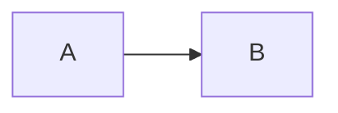

# @142vip/vitepress

基于 VitePress 的文档站封装：主题、Element Plus、**Mermaid 架构图**、全局页脚。

## 快速开始

### 1. 配置

```ts
import { defineVipVitepressConfig, enableVipFooter, getVipThemeConfig } from '@142vip/vitepress'

export default defineVipVitepressConfig({
  title: 'My Docs',
  themeConfig: getVipThemeConfig({
    nav: [],
    // 关闭 VitePress 默认单行 footer，启用全局页脚
    ...enableVipFooter({
      showBackTop: true,
      // true：默认 GitHub / 官网 / npm 徽章；false：不展示；也可传 VipFooterBadgeLink[]
      showBadge: true,
      pkgName: '@142vip/example',
      pkgVersion: '0.0.1',
    }),
  }),
}, {
  mermaid: true, // 或 { theme: 'forest' }
})
```

### 2. 主题

```ts
import defineVipExtendsTheme from '@142vip/vitepress/theme'
import { getTableData } from './project-data'

// VipHomePage 由主题注入，挂在首页 Markdown 正文之后、页脚之前
export default defineVipExtendsTheme(undefined, {
  homePage: {
    tables: [
      { title: '最佳实践', data: getTableData('example') },
      { title: '开源模块', data: getTableData('project') },
    ],
  },
})
```

`homePage` 传入配置对象时挂载内置 `VipHomePage`；`showTeam` / `showOpenSource` / `defaultSlot` 可扩展团队、开源与联系作者等区块。完全自定义时可传 `() => h(...)`，传 `false` 关闭。

### 3. 写图（需已启用 mermaid）

````md



````

**主题规则**：亮色使用所选官方主题；暗黑模式统一使用官方 `dark`，保证可读性。

**展示模式**（`VipMermaid` 自动判断，无需额外配置）：

| 模式 | 触发条件 | 行为 |
|------|----------|------|
| 静态 | 图可完整放入容器 | 居中展示，高度随内容自适应，无操作按钮 |
| 交互 | 宽或高超出展示区域 | 固定视口、自动缩放居中，支持拖拽、滚轮 / 双指缩放、还原与全屏 |

交互能力仅在内容超出时出现；小图保持简洁，大图才提供缩放与全屏。所有图表均支持复制 Markdown 代码块（` ```mermaid ` fence，不含主题配置）到剪贴板。样式使用 VitePress CSS 变量，兼容明暗主题与移动端。

## 页脚 `showBackTop` / `showBadge`

在 `enableVipFooter({ showBackTop: true })` 时挂载 `@142vip/vue` 的 `VipBackTop`；`pkgName` / `pkgVersion` / `showBadge` 透传 `VipFooter` 渲染 Release 与徽章。

| 值 | 行为 |
|----|------|
| `true` | 展示 `@142vip/vue` `VipFooter` 默认徽章（`showBadge: true`） |
| `false` / 未传 | 不展示徽章 |
| `VipFooterBadgeLink[]` | 自定义 `href` / `src` / `alt` 列表 |

## Demo

```shell
pnpm --filter @142vip/vitepress build
pnpm --filter vitepress-demo dev
```

## 证书

[MIT](https://opensource.org/license/MIT)

Copyright (c) 2019-present, @142vip 储凡
