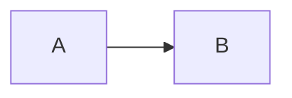

# @142vip/vitepress

[](https://www.npmjs.com/package/@142vip/vitepress)

基于 VitePress 框架搭建静态站点的常用工具包，提供 Element Plus 相关组件和主题

## 安装

须满足 `peerDependencies`（版本见本包 `package.json`：`vitepress`、`vue`、`element-plus`、`mermaid`）。

```shell
# npm
npm install @142vip/vitepress

# pnpm
pnpm add @142vip/vitepress
```

## 功能

- [x] `defineVipVitepressConfig`：合并默认主题、head、favicon、Vite SSR 配置
- [x] 可选 Mermaid 支持（`{ mermaid: true }`）
- [x] `getVipThemeConfig` / `enableVipFooter`：导航、社交链接、全局页脚
- [x] `defineVipExtendsTheme`：扩展默认主题 + Element Plus + `VipMermaid` + 首页区块
- [x] 文档组件：`VipMermaid`、`VipHomePage`、`VipProjectTable`
- [x] `@142vip/vitepress/workspace`：Monorepo `package.json` 索引工具
- [x] TypeDoc 默认配置 `getVipTypedocDefaultConfig`

## 配置

`.vitepress/config.ts` 示例：

```ts
import {
  defineVipVitepressConfig,
  enableVipFooter,
  getVipThemeConfig,
} from '@142vip/vitepress'

export default defineVipVitepressConfig({
  title: 'My Docs',
  themeConfig: getVipThemeConfig({
    nav: [{ text: 'Guide', link: '/guide' }],
    ...enableVipFooter({ showBackTop: true }),
  }),
}, { mermaid: true })
```

`.vitepress/theme/index.ts`：

```ts
import { defineVipExtendsTheme } from '@142vip/vitepress/theme'

export default defineVipExtendsTheme(undefined, {
  homePage: { showTeam: true, showOpenSource: true },
})
```

## 使用

Markdown 中使用 Mermaid（已启用时）：

````markdown

````

组件子路径：

```ts
import { VipHomePage, VipMermaid } from '@142vip/vitepress/components'
```

## 升级

```shell
# 依赖更新
pnpm upgrade @142vip/vitepress
```

## 参考

- [@142vip/vitepress](https://www.npmjs.com/package/@142vip/vitepress)
- [VitePress 文档](https://vitepress.dev/)

## 证书

[MIT](https://opensource.org/license/MIT)

Copyright (c) 2019-present, @142vip 储凡

**仅供学习参考，商业使用请保留作者版权信息，作者不保证也不承担任何软件的使用风险。**
